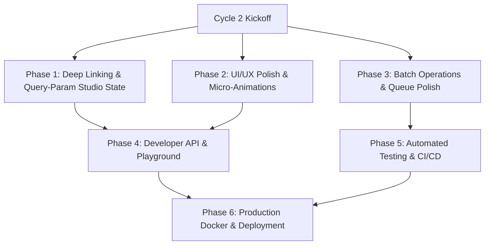

# ConvertIt — Project Status & Next Cycle Roadmap

> **Current Milestone**: Phase 1 MVP & Studio-Based Modular Separation Completed  
> **Code Health**: Passed `bunx tsc --noEmit` (0 Errors)

---

## Part 1: Completed Milestones (Current State)

### 1. Multi-Engine Conversion Core
- [x] **Gotenberg 8.17 Integration**: High-fidelity conversions from PDF to Office formats (DOCX, XLSX, PPTX), HTML, and Markdown, plus document conversions into PDF.
- [x] **PDF Manipulation Engine (`pdf-lib` & `qpdf`)**: Compress, Merge, Split, Rotate (90°/180°/270°), Flatten, Watermark, PDF/A Archival standard, Password Protect (Encrypt), and Password Unlock (Decrypt).
- [x] **Sharp Graphics Engine (libvips)**: High-speed raster transformations (PNG, JPG, WebP, AVIF, GIF, TIFF, BMP), multi-resolution `.ico` Favicon generation, aspect-ratio locked resizing, quality compression, and EXIF privacy stripping.
- [x] **FFmpeg 6.x Media Engine**: Video transcoding (MP4, WebM, MOV, AVI, MKV), audio extraction (MP3, WAV, AAC, FLAC, OGG), animated GIF creation, time trimming, resolution scaling (1080p, 720p, 480p), and SSE real-time progress streaming.
- [x] **Client-Side Developer Utilities**: Fast, 100% private in-browser conversions for JSON ⇋ YAML, CSV ⇋ JSON, Base64 encode/decode, URL encode/decode, and SHA-256 / SHA-512 / MD5 hashing.

---

### 2. Studio-Based Modular Architecture
- [x] **Dedicated Domain Studios**:
  - 📄 `/tools/pdf` — Document & PDF Studio
  - 🎨 `/tools/image` — Image & Graphics Hub
  - 🎬 `/tools/media` — Audio & Video Studio
  - 💻 `/tools/developer` — Developer Utilities & Cryptography
- [x] **Universal Smart Auto-Detect Hub** (`/`): Single dropzone that analyzes dropped file MIME types and mounts the matching studio inline.
- [x] **Clean URL Routing & SEO**: Dynamic titles, meta descriptions, and keywords per studio, with 301 permanent redirects in `next.config.ts` for backward compatibility.
- [x] **Navigation Registry**: Centralized navigation in `app/utils/vars.ts` and `components/SupportConversions.tsx` linking to all 4 studios.

---

### 3. Authentication & User Management
- [x] **Better-Auth Integration**: Email/password authentication, sessions stored in PostgreSQL, and Edge middleware compatibility.
- [x] **User Metadata**: Schema includes `role` (`USER` / `ADMIN`), `plan` (`FREE` / `STANDARD` / `PRO`), `banned`, and creation timestamps.
- [x] **Profile Gateway (`/api/user/me`)**: Returns live user status, plan information, and rate limits.

---

### 4. Tier System & Quota Enforcement
- [x] **Tier Hierarchy**: `GUEST` (10 MB limit) $\rightarrow$ `FREE` (40 MB limit) $\rightarrow$ `STANDARD` (200 MB limit) $\rightarrow$ `PRO` (500 MB limit).
- [x] **File Size & Rate Limit Validations**: Upfront client-side and server-side validation against plan constraints.
- [x] **Billing Dashboard (`/dashboard/billing`)**: Plan ranking enforcement (current plan highlighted with gold ring, lower tiers disabled, higher tiers upgradeable via Razorpay).

---

### 5. Admin Control Center (`/admin`)
- [x] **RBAC Edge Guard**: Only authenticated users with `role: "ADMIN"` can access the admin portal.
- [x] **Dashboard Overview (`/admin`)**: Real-time KPI metric counters (Total Users, Active Subscriptions, Conversions Processed, Storage Usage).
- [x] **User Management Directory (`/admin/users`)**: Search, filter by plan/role, live role updates, plan assignment, and ban/unban toggles.
- [x] **Job History Audit (`/admin/jobs`)**: Paginated conversion log monitoring status, file types, durations, and error traces.

---

## Part 2: Next Development Cycle Roadmap

---

### Phase 1: Deep Linking & Tool Pre-Selection
**Goal**: Make every navigation item link directly to a pre-configured studio tool state (e.g. `/tools/pdf?tool=merge` automatically activates the Merge tab and enables multi-file dropzone).

- [ ] **Studio URL Query Listener**:
  - Update `PDFStudio`, `ImageStudio`, and `MediaStudio` to read `?tool=` and `?format=` parameters from `useSearchParams()`.
  - Automatically set initial Zustand store state (`selectedTool`, `targetFormat`, `activeTab`) based on the URL query.
- [ ] **Multi-File Mode Auto-Enable**:
  - When accessing `tool=merge` or `tool=split`, auto-configure the dropzone to accept multiple files or page range inputs immediately.
- [ ] **Dynamic Breadcrumbs & Studio Switcher**:
  - Add quick studio switcher tabs in the studio header so users can jump between PDF, Image, Media, and Developer tools with one click.

---

### Phase 2: UI/UX & Visual Aesthetics Polish
**Goal**: Elevate the visual identity and tactile feel of ConvertIt to a state-of-the-art SaaS standard.

- [ ] **Dropzone Interactivity & Drag-Over Visuals**:
  - Add animated pulse rings, glowing border gradients, and particle dust effects during active file drag-over.
  - Show file format icon preview and size gauge before conversion starts.
- [ ] **Toast Notification System**:
  - Integrate a unified toast system (e.g. `sonner` or DaisyUI toasts) for copy-to-clipboard, file errors, and upgrade prompts.
- [ ] **Conversion Progress Visualizer**:
  - Enhance progress bars with animated neon gradient fills and live throughput stats (e.g., "Converting page 4 of 12", "Encoding at 32 fps").
- [ ] **Result Card Download Experience**:
  - Add instant file preview modal (view converted PDF or image directly in browser before downloading).
  - Add one-click "Download ZIP", "Copy to Clipboard", and "Convert Another File" actions.

---

### Phase 3: Batch Operations & Download Packaging
**Goal**: Provide bulk conversion workflows for power users on STANDARD and PRO plans.

- [ ] **Batch File List Manager**:
  - Allow queueing 10+ images or documents simultaneously.
  - Per-file format overrides (e.g. convert File 1 to WebP and File 2 to PNG in the same batch).
- [ ] **Client-Side JSZip Packaging**:
  - Automatically package multi-file conversions into a single named `.zip` archive on completion.
- [ ] **Bulk Progress Tracking**:
  - Overall batch progress bar + individual file status icons (Pending, Converting, Success, Error).

---

### Phase 4: Developer API & Key Playground
**Goal**: Enable developer customers to use ConvertIt programmatically via API keys.

- [ ] **API Keys Management (`/dashboard/api-keys`)**:
  - Generate, revoke, and name scoped API keys (`sk_live_...`).
  - Show usage metrics (requests this month, rate limit hits).
- [ ] **Interactive API Documentation & Playground**:
  - Public documentation page (`/docs/api`) with interactive cURL, Python, and Node.js code snippets for PDF, Image, and Media endpoints.

---

### Phase 5: Automated Testing & Verification
**Goal**: Ensure rock-solid stability and prevent regression across conversion engines.

- [ ] **Unit Tests (Vitest)**:
  - Test file detection logic, plan limits calculation, and developer utilities.
- [ ] **Integration Tests**:
  - Test Gotenberg, Sharp, and FFmpeg route handlers with sample files in OS temp dir.
- [ ] **E2E Tests (Playwright)**:
  - Test authentication flow, file drop to conversion download flow, and billing tier upgrades.

---

### Phase 6: Production Docker & Deployment Readiness
**Goal**: One-command reproducible deployment with full engine support.

- [ ] **Unified `docker-compose.yml`**:
  - Services: Next.js App, Gotenberg 8.x container, Redis queue container, PostgreSQL database.
- [ ] **Environment Validation Check (`scripts/verify-env.ts`)**:
  - Automated startup script checking database connection, Redis connectivity, Gotenberg health endpoint, and CLI binaries (`qpdf`, `ffmpeg`).
